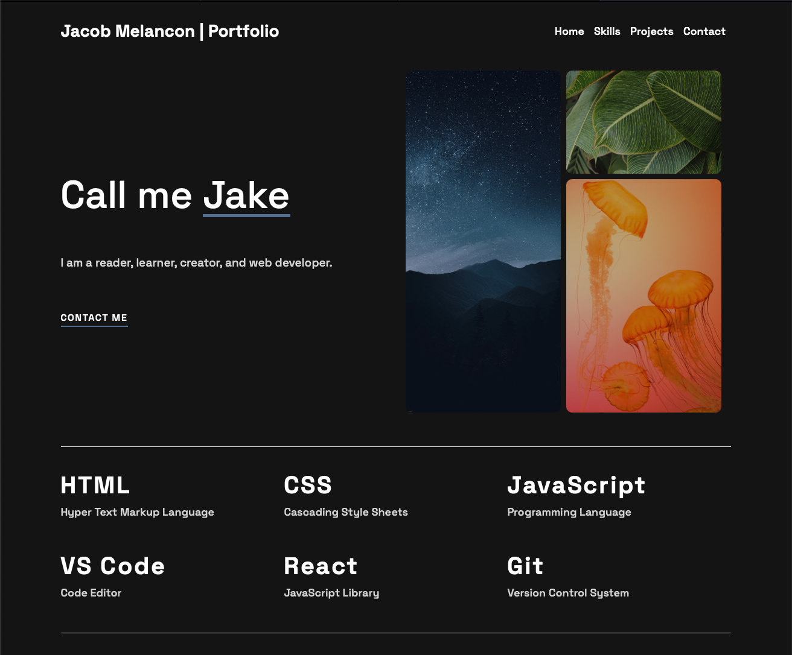
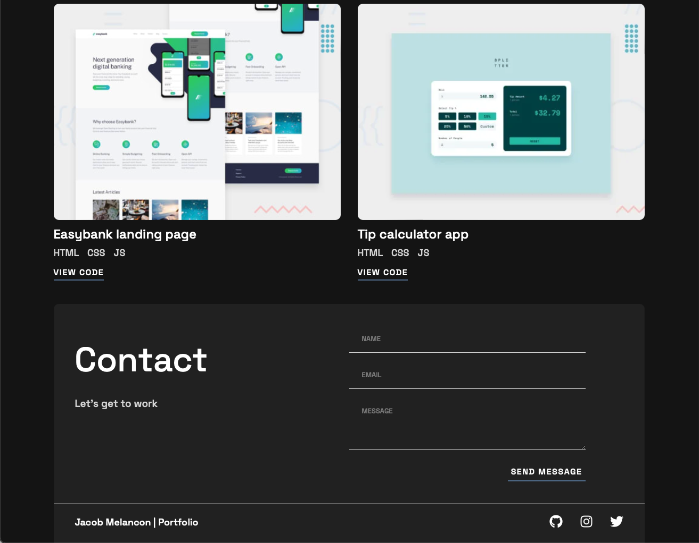
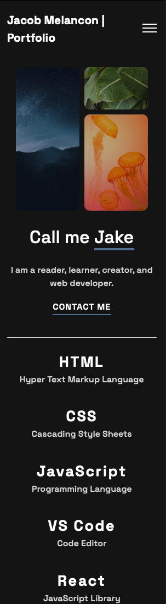
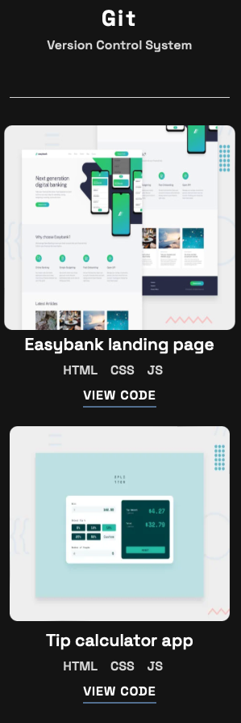
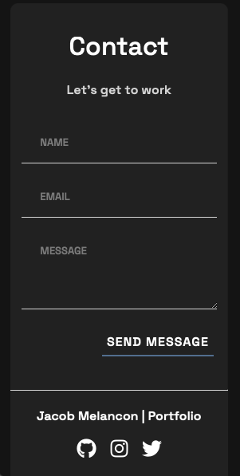

## jakecodes.net

Updated portfolio site created using React

## Design

#### Desktop:

---

#### Mobile:

## Links / Sources

- [Frontend Mentor Challenge](https://www.frontendmentor.io/challenges/singlepage-developer-portfolio-bBVj2ZPi-x)
- Very helpful guidance provided by the _Coder Coder_ [Youtube channel](https://www.youtube.com/watch?v=65GVcdESj3s&list=PLUWqFDiirlsuVOx2WWruGfw5nnuaWHNvI).
- [Photo1](https://www.pexels.com/photo/starry-sky-over-mountains-2469122/) by Cliford Mervil from Pexels
- [Photo2](https://www.pexels.com/photo/close-up-photography-of-green-leaves-797797/) by Vasanth Babu from Pexels
- [Photo3](https://www.pexels.com/photo/orange-jellyfish-wallpaper-1784578/) by Zetong Li from Pexels
- Form powered by [getform](https://getform.io)
- Deployed using [netlify](https://www.netlify.com)
